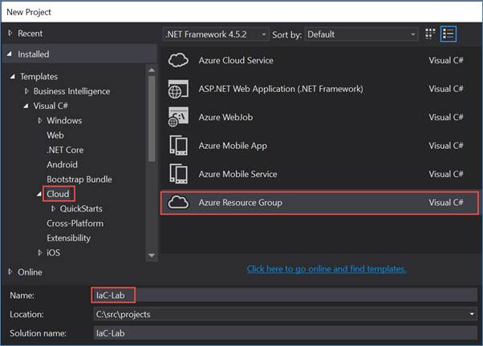
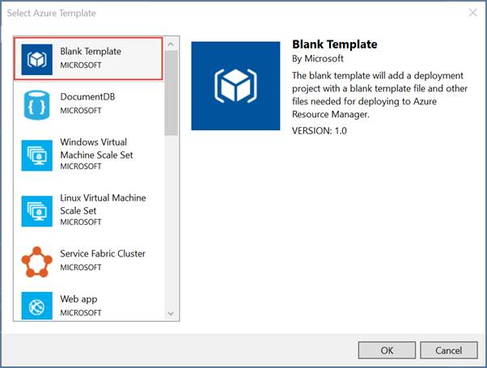
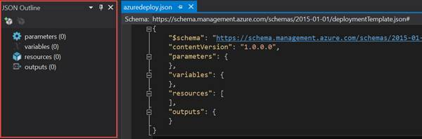
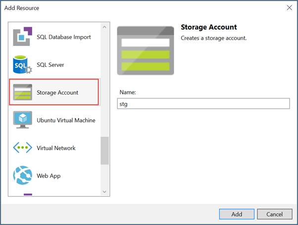
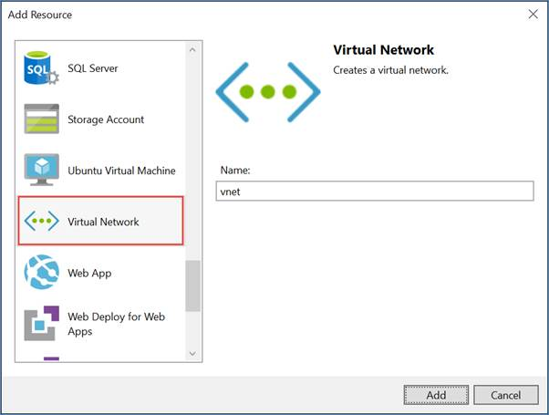
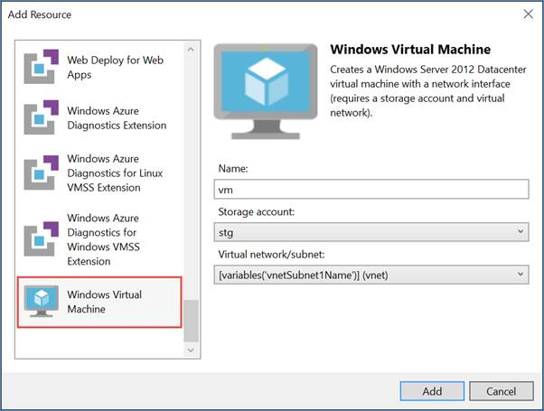
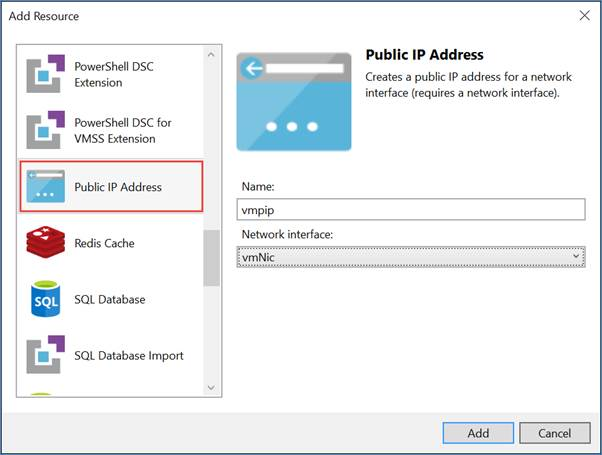
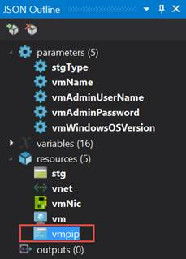
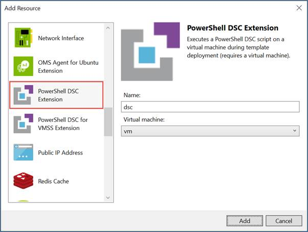

# Demo

In this demo you will be introduced to the authoring tools used to create ARM templates using Visual Studio 2015.  You will create a new ARM template from scratch to provision an Azure virtual machine.  For this demo, you will be using the following:
* Visual Studio 2015 w/Update 3
* Microsoft Azure SDK for .NET v2.9.1

After completing this demo, you will understand:
* The overall structure of an ARM template
* How resources are added and configured in an ARM template
* How parameters are passed into an ARM template

## Pre-requisites

None

## Setup

No setup required.

## Demo Steps
_Estimated Time: 10 minutes_

#### Create a new Azure Resource Group Project####
1.	Open Visual Studio.  
2.	From the main menu, select File | New | Project.
    a.	Choose the Azure Resource Group project.
    b.	Set the Name of the project to IaC-Demo.
    c.	Click OK.
 
 

3.	In the Azure Template window, choose the Blank Template and click OK.
 
 

4.	From the main menu, select View | Solution Explorer.
5.	In Solution Explorer, expand the Templates folder and double-click on azuredeploy.json.  Opening this file in the Visual Studio editor should also result in the JSON Outline window appearing as shown here.  If it is not visible, you can open it by selecting View | Other Windows | JSON Outline.
 
 

#### Add Azure resources to the deployment template####
1.	In the JSON Outline window, right-click on resources and select Add New Resource.
2.	In the Add Resource window, select Storage Account.
    a.	Set the resource Name to stg.  Note: Be sure to use all lowercase letters.  Azure storage account names must be all lowercase and can only contain alpha-numeric characters.
    b.	Click Add.

 

3.	In the JSON Outline window, right-click on resources and select Add New Resource.
4.	In the Add Resource window, select Virtual Network.
    a.	Set the resource Name to vnet.
    b.	Click Add.

 

5.	In the JSON Outline window, right-click on resources and select Add New Resource.
6.	In the Add Resource window, select Windows Virtual Machine.
    a.	Set the resource Name to vm.
    b.	Set the Storage account field to stg, which is the storage account you created previously.
    c.	Set the Virtual network/subnet field to [variables(‘vnetSubnet1Name/](vnet), which is the virtual network you created previously.  By default, it creates two subnets but you can add, remove, or rename the subnets in the template.  For this lab you will just use the first default subnet.
    d.	Click Add.

 

7.	In the JSON Outline window, right-click on resources and select Add New Resource.
8.	In the Add Resource window, select Public IP Address.
    a.	Set the resource Name to vmpip.
    b.	Set the Network interface field to vmNic.  The Network Interface Card (Nic) resource was added when you added the virtual machine resource.
    c.	Click Add.

 

9.	In the JSON Outline window, expand the parameters node to show all the parameters.
    a.	Right-click on the vmpipDnsName and select Delete.
10.	In the editor window for azuredeploy.json, add a new variable called vmpipDnsName as shown here.
```JSON
  "variables": {
    "stgName": "[concat('stg', uniqueString(resourceGroup().id))]",
    "vnetPrefix": "10.0.0.0/16",
    "vnetSubnet1Name": "Subnet-1",
    "vnetSubnet1Prefix": "10.0.0.0/24",
    "vnetSubnet2Name": "Subnet-2",
    "vnetSubnet2Prefix": "10.0.1.0/24",
    "vmImagePublisher": "MicrosoftWindowsServer",
    "vmImageOffer": "WindowsServer",
    "vmOSDiskName": "vmOSDisk",
    "vmVmSize": "Standard_D1",
    "vmVnetID": "[resourceId('Microsoft.Network/virtualNetworks', 'vnet')]",
    "vmSubnetRef": "[concat(variables('vmVnetID'), '/subnets/', variables('vnetSubnet1Name'))]",
    "vmStorageAccountContainerName": "vhds",
    "vmNicName": "[concat(parameters('vmName'), 'NetworkInterface')]",
    "vmpipName": "vmpip",
    "vmpipDnsName": "[concat(parameters('vmName'), uniqueString(resourceGroup().id))]"
```

What we did in last few steps are re-factor the parameter called vmpipDnsName into a variable that will automatically generate a unique DNS name for the Public IP Address.  If we didn’t do this, then the end-user deploying the template could potentially experience a DNS name conflict if the value specified is not unique.  By refactoring to a variable and using the uniqueString function, we’re able to provide a better end-user experience during deployment.

11.	In the JSON Outline window, click on the vmpip resource under the resources node.  

 

The JSON Outline windows is also a useful way to navigate through the JSON text file that describes the environment.
12.	Change dnsSettings.domainNameLabel property for the Public IP Address to reference the vmpipDnsName variable.

```JSON
    {
      "name": "[variables('vmpipName')]",
      "type": "Microsoft.Network/publicIPAddresses",
      "location": "[resourceGroup().location]",
      "apiVersion": "2015-06-15",
      "dependsOn": [ ],
      "tags": {
        "displayName": "vmpip"
      },
      "properties": {
        "publicIPAllocationMethod": "Dynamic",
        "dnsSettings": {
          "domainNameLabel": "[variables('vmpipDnsName')]"
        }
      }
    }
```

13.	Press Ctrl-S to save the changes.
14.	In the JSON Outline window, right-click on resources and select Add New Resource.
15.	In the Add Resource window, select PowerShell DSC Extension.
    a.	Set the resource Name to dsc.
    b.	Set the Virtual machine field to vm, which is the virtual machine resource you added previously to the template.
    c.	Click Add.



16.	In the Solution Explorer window, expand the DSC folder and double-click on the dsc.ps1 file. 
a.	Replace the contents of dsc.p1 with the following code shown here.
```
Configuration Main
{

Param ( [string] $nodeName )

Import-DscResource -ModuleName PSDesiredStateConfiguration

Node $nodeName
  {
    WindowsFeature WebServerRole
    {
      Name = "Web-Server"
      Ensure = "Present"
    }
    WindowsFeature WebManagementService
    {
      Name = "Web-Mgmt-Service"
      Ensure = "Present"
    }
    WindowsFeature ASPNet45
    {
      Name = "Web-Asp-Net45"
      Ensure = "Present"
    }
    Script DownloadWebDeploy
    {
        TestScript = {
            Test-Path "C:\WindowsAzure\WebDeploy_amd64_en-US.msi"
        }
        SetScript ={
            $source = "https://download.microsoft.com/download/0/1/D/01DC28EA-638C-4A22-A57B-4CEF97755C6C/WebDeploy_amd64_en-US.msi"
            $dest = "C:\WindowsAzure\WebDeploy_amd64_en-US.msi"
            Invoke-WebRequest $source -OutFile $dest
        }
        GetScript = {@{Result = "DownloadWebDeploy"}}
        DependsOn = "[WindowsFeature]WebServerRole"
    }
    Package InstallWebDeploy
    {
        Ensure = "Present"  
        Path  = "C:\WindowsAzure\WebDeploy_amd64_en-US.msi"
        Name = "Microsoft Web Deploy 3.6"
        ProductId = "{ED4CC1E5-043E-4157-8452-B5E533FE2BA1}"
        Arguments = "ADDLOCAL=ALL"
        DependsOn = "[Script]DownloadWebDeploy"
    }
    Service StartWebDeploy
    {                    
        Name = "WMSVC"
        StartupType = "Automatic"
        State = "Running"
        DependsOn = "[Package]InstallWebDeploy"
    }
	Script DownloadWebDeployPackage
    {
        TestScript = {
    		Test-Path -Path "C:\TR23WebApp.zip"
        }
        SetScript ={
			$source  = "https://github.com/GSIAzureCOE/Networking/raw/master/Demo-TrafficManager/TM-Demo-Solution/TM-Demo/App/TM-Demo-App.zip"
			$dest    = "C:\TR23WebApp.zip"
			Invoke-WebRequest $source -OutFile $dest
        }
        GetScript = {@{Result = "DownloadWebDeployPackage"}}
        DependsOn = "[Service]StartWebDeploy"
	}
	Script InstallWebDeployPackage
    {
        TestScript = {
    		Test-Path -Path "HKLM:\SOFTWARE\TR23\WebDeployPkgInstalled"
        }
        SetScript ={
			$appName      = "IIS Web Application Name"
			$siteName     = "Default Web Site"
			$msDeployPath = "C:\Program Files\IIS\Microsoft Web Deploy V3\msdeploy.exe" 

			& $msDeployPath "-verb:sync", "-source:package=C:\TR23WebApp.zip", "-dest:auto,ComputerName=""localhost""", "-setParam:name=""$appName"",value=""$siteName"""
		    
			if ($LASTEXITCODE -eq 0) 
			{
				New-Item -Path "HKLM:\SOFTWARE\TR23\WebDeployPkgInstalled" -Force
			}
        }
        GetScript = {@{Result = "InstallWebDeployPackage"}}
        DependsOn = "[Script]DownloadWebDeployPackage"
	}
  }
}
```

17.	Press Ctrl-S to save the changes.
18.	In the Solution Explorer window, double-click on azuredeploy.parameters.json.
    a.	Replace the parameters section with the highlighted code shown here.

```JSON
{
    "$schema": "https://schema.management.azure.com/schemas/2015-01-01/deploymentParameters.json#",
    "contentVersion": "1.0.0.0",
    "parameters": {
        "vmName": {
            "value": "iisvm"
        },
        "vmAdminUserName": {
            "value": "adminuser"
        },
        "vmAdminPassword": {
            "value": "TechReady23!"
        }
    }
}
```

19.	Press Ctrl-S to save the changes.

A best practice is to store credentials in Azure Key Vault and have Azure Resource Manager retrieve the credentials from the vault to provision the administrator credentials in the virtual machine.  Azure Key Vault is beyond the scope of this lab so we’re storing the credentials in the parameters file for simplicity.
You now have a complete ARM template that provisions an IaaS environment with the following resources:
* A storage account to store the virtual machine’s hard disk (.vhd).
* A virtual network with two subnets.  A virtual machine requires a virtual network.
* A virtual network interface card (NIC).  This binds the virtual machine to the virtual network.
* A public IP address resource.  This is necessary if you want the virtual machine to be publicly accessible.
* A PowerShell DSC extension to configure the internals of the virtual machine.  The DSC configuration script adds the following configuration:
* Configures the virtual machine to be an IIS Web Server,
    * Adds support for ASP.NET 4.5,
    * Downloads and installs the Web Deploy Service package,
    * Starts the Web Deploy Service,
    * Downloads a sample Web Deploy Package from GitHub,
    * Installs the Web Deploy Package


## Cleanup
No cleanup required.
