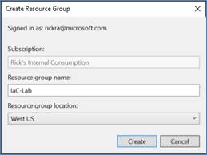
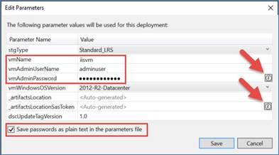
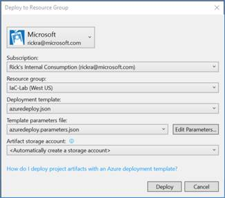
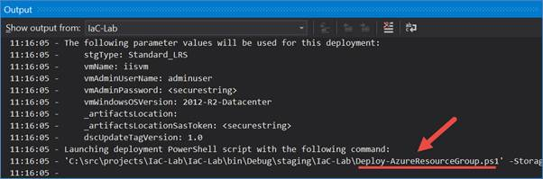
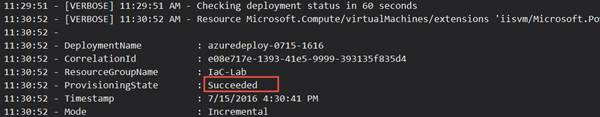
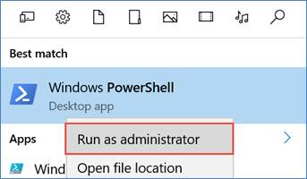
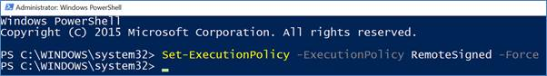
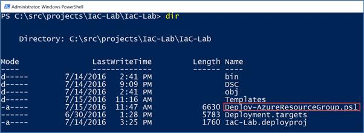
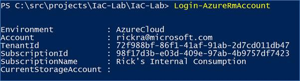

# Demo

In this demo you will deploy the ARM template created in the previous demo.  There are several ways one could go about deploying the ARM template, such as
* Use Azure PowerShell - “AzureRm” Cmdlets,
* Use Azure Command-Line Interface (CLI) from a Mac, Linux or Windows client,
* Deploy directly from Visual Studio,
* Use the “Template Deployment” feature in the Azure portal,
* Deploy as part of Continuous Deployment Strategy (see TR22 session <link here>)
For this demo you will first deploy from Visual Studio since you used Visual Studio to create the template.  Then, you will deploy the same template using PowerShell.  You will be using 
* Visual Studio 2015 w/Update 3
* Microsoft Azure SDK for .NET v2.9.1
* Azure PowerShell Cmdlets v1.6.0
After completing this demo, you will understand:
* How to deploy an ARM template from Visual Studio
* How to deploy an ARM template using PowerShell


## Pre-requisites

None

## Setup

No setup required.

## Demo Steps
_Estimated Time: 10 minutes_

#### Deploy the ARM Template
Deploy from Visual Studio
1.	From the main menu, select Project | Deploy | New Deployment.
2.	In the Deploy to Resource Group window
    a.	Set the Subscription field to your Azure Subscription.
    b.	Set the Resource Group field to <Create New ..>.
    c.	In the Create Resource Group dialog, select a Resource group location closest to you.  This is where the resource group will be created and eventually where the resources will be deployed.
    d.	Click Create.

    

    e.	Click the Edit Parameters button.
    f.	In the Edit Parameters dialog

    

    i.	Set the vmName field to iisvm.  Make sure this is lowercase.
    ii.	Set the vmAdminUserName field to adminuser.
    iii.	Set the vmAdminPassword field to TechReady23!
    iv.	Check the box to save passwords in the parameters file.
    v.	Click Save. 

Note: It is a best practice to save passwords in Azure Key Vault instead of in source code.  However, Azure Key Vault is beyond the scope of this lab so we’re storing the password in the azuredeploy.parameters.json file.  
The Visual Studio tools integrate with your Azure Key Vault (assuming you have already created a Key Vault) and enable you to store your passwords and secrets in the vault.  To access these features of the Visual Studio tools click on the Key Vault icon as shown above.
    g.	Set the Artifact storage account field to <Automatically create a storage account> if it is not already.
    h.	Click Deploy.



When you click Deploy, Visual Studio invokes the Deploy-AzureResourceGroup.ps1 PowerShell script that is part of your Azure Resource Group project.  You can see evidence of this in the Output window as shown here.  Note: If the Output window is not visible then you can open it by selecting View | Output from the main menu.



Explore the output in the Output window to understand what the deployment script is doing and review the Deploy-AzureResourceGroup.ps1 script in the project.  Some things that are worthy of pointing out are 
•	The script generates a unique name for a storage account that is used solely to upload the DSC artifacts to blob storage.  After the virtual machine is provisioned, the DSC.zip file is copied into the virtual machine using a SAS token and the DSC process internal to the virtual machine is started.  The storage account created for this purpose is created in a new resource group call ARM_Deploy_Staging.  If you open the portal you will see this resource group and the auto-generated storage account.  If you look at the blob container in the storage account you will see the DSC.zip fle.
•	The script automatically generates the DSC.zip file.  So, if you add additional DSC modules such as xNetworking, xActiveDirectory, xSQServer, etc. to this folder, the script will include them in the DSC.zip file that is copied to the virtual machine.
•	The script automatically generates a SAS token (and URL) that is used by the virtual machine after it is provisioned to copy the DSC.zip file locally and start the DSC process.
•	The bulk of the script is only applicable if there are artifacts that need to be uploaded.  For example, in this case we need the DSC configuration (an artifact) copied to the virtual machine to configure it the way we want.  If we didn’t have any artifacts, then the script essentially just calls New-AzureRmResourceGroup to create the resource group and then New-AzureRmResourceGroupDeployment to deploy the resources into the resource group. 

A successful deployment will take about 15 minutes to finish.  You will see evidence of this in the Output window as shown here.



If your deployment is still running you may continue ahead to the next section.  It is not necessary to wait.  Leave Visual Studio open so you can come back to it later.

## Deploy using PowerShell
1.	Open PowerShell on your machine.  Press the <Windows Key> and then type PowerShell.
2.	Right-click on Windows PowerShell from the search result and select Run as administrator.


 

3.	In the PowerShell console, run the Set-ExecutionPolicy cmdlet to allow script execution on your machine.  

```JSON
Set-ExecutionPolicy -ExecutionPolicy RemoteSigned -Force
```
Note: This is a one-time step and doesn’t need to be repeated every time.  This is also why you had to run PowerShell as an administrator – because you are changing the execution policy on the machine.
 
4.	Change directory to the location where your Azure Resource Group project was created.  Specifically, you want to be in the directory where the Deploy-AzureResourceGroup.ps1 script is located.


 

5.	Sign-in to your Azure subscription using the Login-AzureRmAccount cmdlet.


 

6.	Invoke the deployment script from the Azure Resource Group project using the command shown here.

```JSON
.\Deploy-AzureResourceGroup.ps1 -ResourceGroupName "IaC-Lab-2" -ResourceGroupLocation "westus" -UploadArtifacts
```
If you recall from earlier observations of the script, there is one mandatory parameter which is the ResourceGroupLocation, for which a value of westus is provided.  The ResourceGroupName parameter is not mandatory, however it defaults to IaC-Lab and since that was the resource group name you used when deploying from Visual Studio, a new value needs to be provided.  Finally, the UploadArtifacts switch must be specified to indicate to the script that we want it to create the DSC.zip file, create a storage account to store the DSC.zip file, and other steps as identified previously.

The output from the script is the same as what you saw in the scenario where you deployed directly from Visual Studio.  After about 15 minutes, you will see output indicating a successful deployment as shown here.




If your deployment is still running you may continue ahead to the next section.  It is not necessary to wait.  Leave the PowerShell console open so you can come back to it later if you want.


## Cleanup
No cleanup required.
