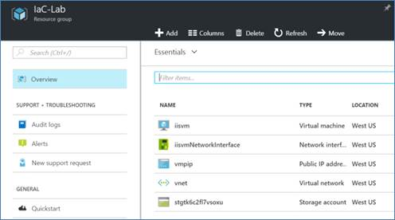
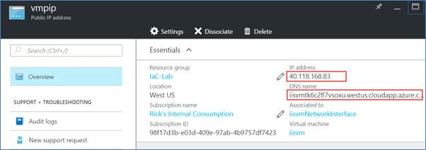
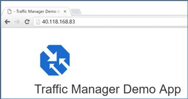

#Demo - 

In this demo you will be introduced to the authoring tools used to create ARM templates using Visual Studio 2015.  You will create a new ARM template from scratch to provision an Azure virtual machine.  For this demo, you will be using the following:
•	Visual Studio 2015 w/Update 3
•	Microsoft Azure SDK for .NET v2.9.1
After completing this demo, you will understand:
•	The overall structure of an ARM template
•	How resources are added and configured in an ARM template
•	How parameters are passed into an ARM template

##Pre-requisites

None

##Setup

No setup required.

##Demo Steps
_Estimated Time: 10 minutes_
In this exercise you will simply verify that the infrastructure as described in the ARM template and the virtual machine configuration as described in the DSC script are working as expected. 
Recall, the DSC script configures the virtual machine as an IIS server and also deploys a web deploy package to the virtual machine.  The web deploy package contains the application we expect IIS to serve when a user browses to the virtual machine’s public IP address.
Create a new Azure Resource Group Project
1.	Sign-in to the Azure portal (https://portal.azure.com).
2.	In the Azure portal, click on Resource Groups.
3.	Click on the resource group named IaC-Lab.  Recall, this was the resource group deployed using Visual Studio.  The deployment should be completed by this time.

 

The resource group blade will show all the resources in the resource group.

4.	Click on the Public IP Address resource named vmpip.
5.	In the Public IP Address blade, copy either the IP Address or the DNS name values shown in the Essentials section of the blade.

 
6.	Open a browser window and navigate to either the IP Address or DNS Name.  If the deployment was successful, then you will see the application that was included in the web deploy package as shown here.
 
 
 

##Cleanup
No cleanup required.